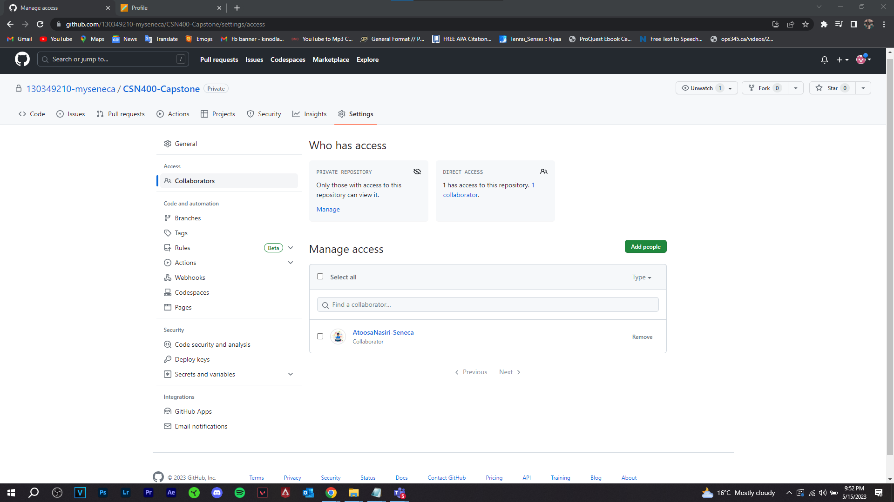

# This is my checkpoint 1

- **COURSE INFORMATION: NDD**
- **STUDENT’S NAME: Kinod Lakdinu Melewa Thanthrige**
- **STUDENT'S NUMBER: 130349210**
- **GITHUB USER_ID: 130349210-myseneca**
- **TEACHER’S NAME: Atoosa Nasiri**

### Table of Contents
1. [My Image](#my-image)
2. [My Single Line Code Snippet](#my-single-line-of-code-snippet)
3. [My Multi Line Code Snippet](#my-multiline-of-code-snippet)
4. [Sample Json Objects](sample-json-objects)
5. [Sample Table](sample-table)
6. [Sample Hyperlink](sample-hyperlink)

### My Image
This is my image submission



### My Single Line of Code Snippet
This is my single line of code snippet is `az login`


### My Multiline of Code Snippet
This is my multi-line of code snippet;
```python
my_list = ["blue", "red", "green"]

#1- Using sort or srted directly or with specifc keys
my_list.sort() #sorts alphabetically or in an ascending order for numeric data 
my_list = sorted(my_list, key=len) #sorts the list based on the length of the strings from shortest to longest. 
# You can use reverse=True to flip the order

#2- Using locale and functools 
import locale
from functools import cmp_to_key
my_list = sorted(my_list, key=cmp_to_key(locale.strcoll)) 
```


### Sample Jason Objects
This is my sample jason objects


### Sample Table
This is my sample table


### Sample Hyperlink
This is my sample hyerlink
