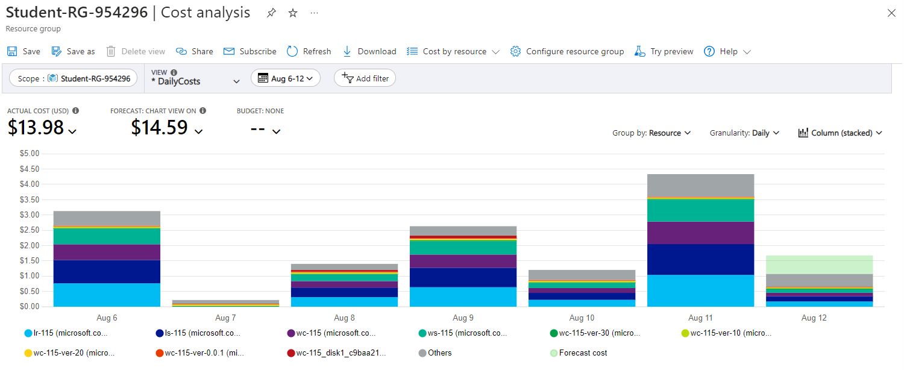
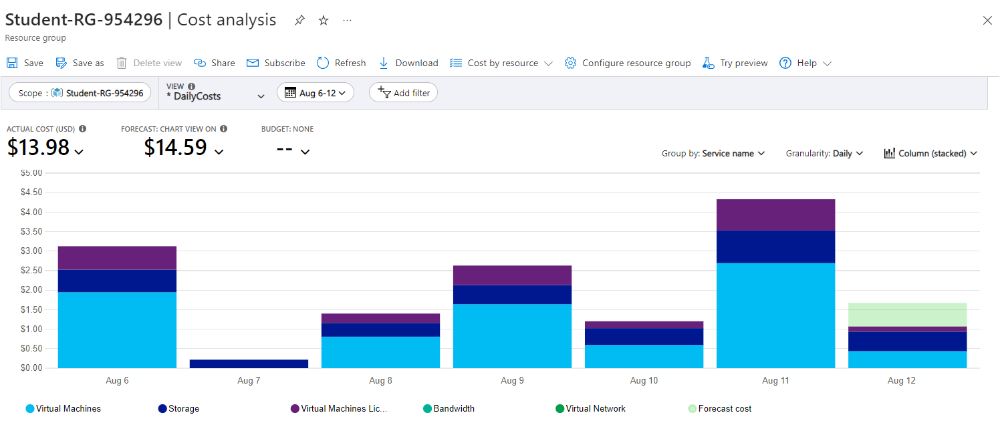
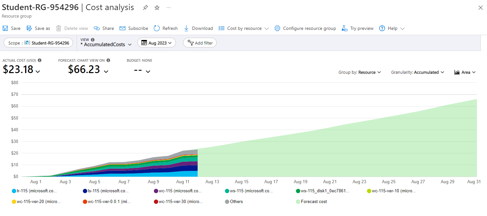
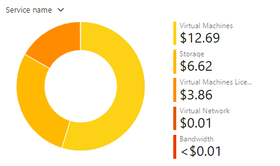
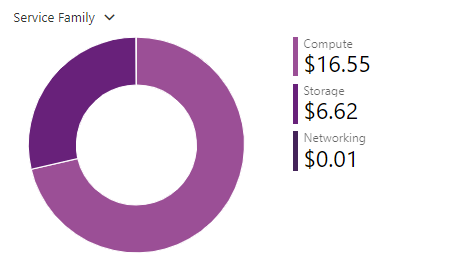
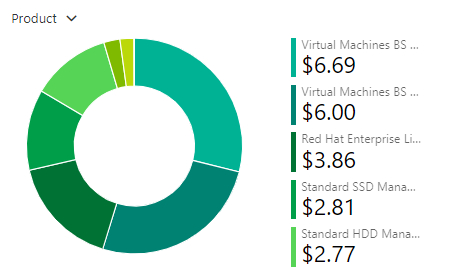

# Checkpoint 10 Submission

- **COURSE INFORMATION: NDD**
- **STUDENT’S NAME: Kinod Lakdinu Melewa Thanthrige**
- **STUDENT'S NUMBER: 130349210**
- **GITHUB USER_ID: 130349210-myseneca**
- **TEACHER’S NAME: Atoosa Nasiri**

### **Table of Contents**
**1.** [Part A - Route Table Updates](#Route-Table-Updates)

**2.** [Part B - Port Forwarding Basic Connectivity](#Port-Forwarding-Basic-Connectivity)

**3.** [Part C - Logging & Isolating Masqueraded Packets](#Logging-&-Isolating-Masqueraded-Packets)

**4.** [Part D - Azure Cost Analysis Charts](#Azure-Cost-Analysis-Charts)

#
### **Route Table Updates**
- **Sucessful Ping with the HUBVNET Router**

#
### **Port Forwarding Basic Connectivity**

#
### **Logging & Isolating Masqueraded Packets**

#
### **Azure Cost Analysis Charts**
| No. | Scope | Chart Type | VIEW Type |  Date Range | Group By | Granularity| Example |
|-|-|-|-|-|-|-|-|
|1|Student-RG-954296| Column (Stacked) | DailyCosts | Last 7 Days | Resource | Daily |  |
|2|Student-RG-954296| Column (Stacked) | DailyCosts | Last 7 Days | Service | Daily |  |
|3|Student-RG-954296| Area| AccumulatedCosts | Last 7 Days | Resource | Accumulated |  |
|4|Student-RG-954296| Pie Chart | NA | Last Month | Service Name | NA |  |
|5|Student-RG-954296| Pie Chart | NA | Last Month | Service Family | NA |  |
|6|Student-RG-954296| Pie Chart | NA | Last Month | Product | NA |  |
