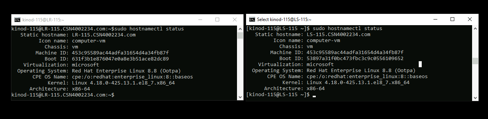
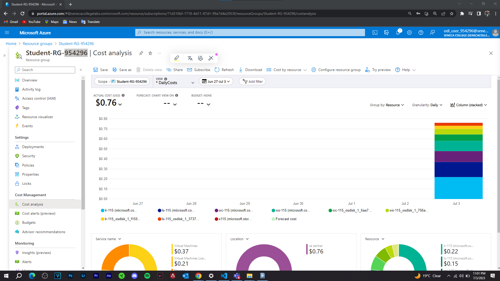
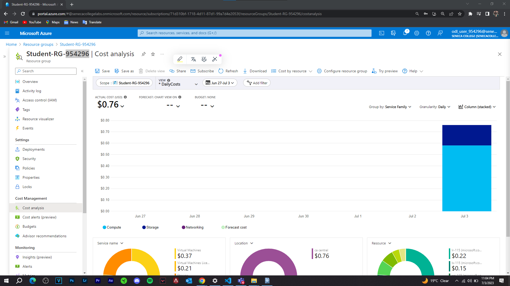
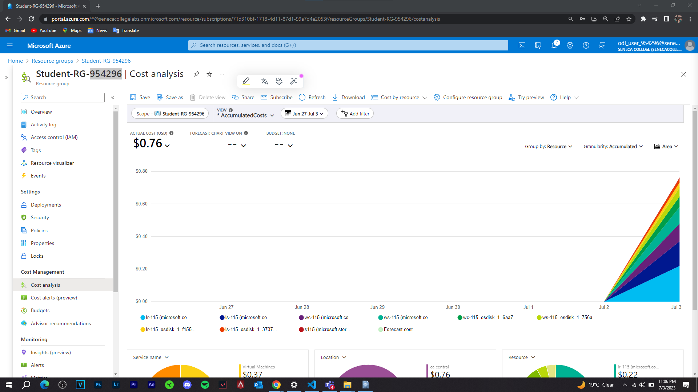
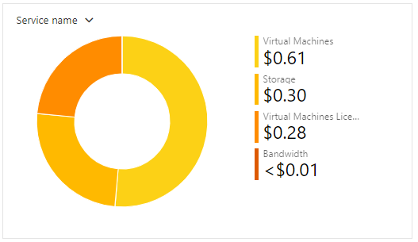
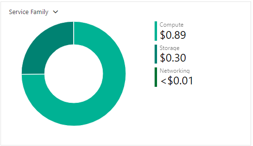
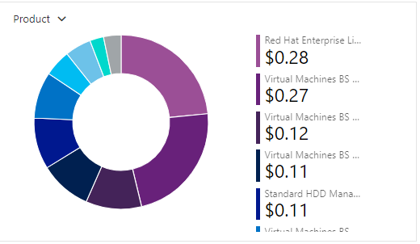
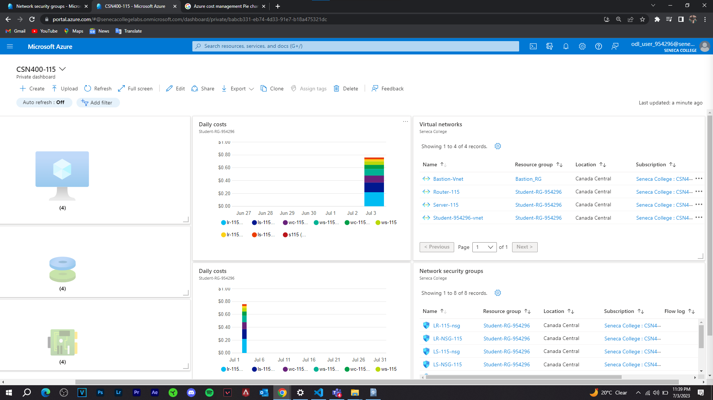

# Checkpoint 7 Submission

- **COURSE INFORMATION: NDD**
- **STUDENT’S NAME: Kinod Lakdinu Melewa Thanthrige**
- **STUDENT'S NUMBER: 130349210**
- **GITHUB USER_ID: 130349210-myseneca**
- **TEACHER’S NAME: Atoosa Nasiri**

### Table of Contents
1. [Part A - Creating & Configuring VMs Using Portal](#Creating-&-Configuring-VMs-Using-Portal)
2. [Part B - Enable IP_Forwarding Using Portal](#Enable-IP_Forwarding-Using-Portal)
3. [Part C - Basic-Connectivity-VM-Configuration](#Basic-Connectivity-VM-Configuration)
4. [Part D - Creating & Configuring VM Images Using Portal](#Creating-&-Configuring-VM-Images-Using-Portal)
5. [Part E - Azure Cost Analysis Charts](#Azure-Cost-Analysis-Charts)
6. [Part F - Create Customized Azure Dashboard](#Create-Customized-Azure-Dashboard)

#

### **Creating & Configuring VMs Using Portal**

- **What is the difference between Windows machine NSG and Linux machine NSG rules? Why? Do you need a rule for ssh or rdp? What happens if you delete specific ssh and rdp rules?**

The main difference between Windows machine NSG rules and Linux machine NSG rules can be considered in the protocols and ports which are commonly associated with the specific operating systems.

For Windows machines, you typically need to allow RDP (3389) traffic if you want to connect to the Windows VM using RDP. Simply without an NSG rule allowing RDP traffic, you won't be able to establish an RDP connection. On the other hand, Linux machines usually need to allow SSH (22) traffic if you want to connect to the Linux VM using SSH. Simply without an NSG rule allowing SSH traffic, you won't be able to establish an SSH connection.

If the user deletes the specific SSH or RDP rule from the NSG which is associated with the specific virtual machine, the corresponding protocol (SSH or RDP) will be blocked. As a result, the user won't be able to establish SSH or RDP connections to the specific VM.

- **List of all Resource Groups**

- **List of all the Virtual Machines**

- **List of all the Network NICs**

- **List of all the Network NSGs**

- **List of all the Disks**

#

### **Enable IP_Forwarding Using Portal**

**1) Check the status of ip-forwarding using the command az network nic ip-config show with output format as json. Include only the command not output including the --quey you used in your submission.**

- az network nic ip-config show --name "lr-115908_z1" --nic-name "lr-115908_z1" --resource-group "Student-RG-954296" --query '{forwarding: enableIPForwarding}' --output json

**2) When your output format is json, which property shows the status of the ip-forwarding attribute? Embed only the property that shows the status of ip-forwarding.**

- "enableIPForwarding": true

**3) Check if the IP forwarding in NIC is enabled using Azure bash. 👉 Hint: az network nic show -g "rg-name" -n "nic-name" --query "enableIpForwarding"**

- az network nic show --resource-group "Student-RG-954296" --name "lr-115908_z1" --query "enableIpForwarding"
#

### **Basic-Connectivity-VM-Configuration**

**1) In configuring your Linux VMs, for the step "Remove the firewalld service", which command will you be using?**

- sudo yum remove firewalld

**2)In configuring your Linux VMs, what command do you use to check the status of iptabels?**

- sudo systemctl status iptables

**3)How can you make iptables service start automatically after reboot on CenOS/RHEL8?**

- sudo systemctl enable iptables

**4)Run a command in LR-xx that shows all iptables chains with their order number. What is the default setting? Include both the command and its output in your submission. How could you improve these settings to be less vulnerable to attacks?**

- sudo iptables -t filter -L "CHAIN" --line-numbers -n -v

- sudo iptables -L --line-numbers

- By limiting access to specific IP addresses, by setting the default policy of the chains to DROP instead of ACCEPT and keep them updated/reviewed everyday.

**5)Run a command that shows the hostname in LR-XX and LX-XX. Embed the output in your submission.**

 

#

### **Creating & Configuring VM Images Using Portal**

**1) Run a command in CLI that lists all your Custom Images. Change the output format to table format and embed the answer in your submission.**

**2) Delete your VMs after your work is completed. Run a command in CLI that lists all your VMs. Hint: az vm list .... Change the output format to table format and embed the answer in your submission.**

**3) Recreate all VMs from your images, and establish basic connectivity. How long the entire process took? How can you do this more efficiently?**

- Around 10 minutes for the whole process 

- We can create a create to utilize the images when running

#

### **Azure Cost Analysis Charts**

| No. | Scope | Chart Type | VIEW Type |  Date Range | Group By | Granularity| Example |
|-|-|-|-|-|-|-|-|
|1|Student-RG-954296| Column (Stacked) | DailyCosts | Last 7 Days | Resource | Daily |  |
|2|Student-RG-954296| Column (Stacked) | DailyCosts | Last 7 Days | Service | Daily |  |
|3|Student-RG-954296| Area| AccumulatedCosts | Last 7 Days | Resource | Accumulated |  |
|4|Student-RG-954296| Pie Chart | NA | Last Month | Service Name | NA |  |
|5|Student-RG-954296| Pie Chart | NA | Last Month | Service Family | NA |  |
|6|Student-RG-954296| Pie Chart | NA | Last Month | Product | NA |  |

#

### **Create Customized Azure Dashboard**

