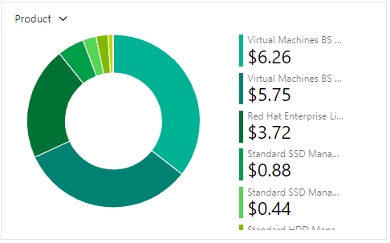

# Checkpoint 8 Submission

- **COURSE INFORMATION: NDD**
- **STUDENT’S NAME: Kinod Lakdinu Melewa Thanthrige**
- **STUDENT'S NUMBER: 130349210**
- **GITHUB USER_ID: 130349210-myseneca**
- **TEACHER’S NAME: Atoosa Nasiri**

### **Table of Contents**
**1.** [Part A - Creating and Configuring VMs using Azure CLI Scripts](#Creating-and-Configuring-VMs-using-Azure-CLI-Scripts)

**2.** [Part B - Basic Connectivity and Linux VMs Firewall Setting](#Basic-Connectivity-and-Linux-VMs-Firewall-Setting)

**3.** [Part C - Azure Cost Analysis Charts](#Azure-Cost-Analysis-Charts)

#
### **Creating and Configuring VMs using Azure CLI Scripts**

**1. Get a list of your VM, NSG, NIC, and Disks using Azure CLI in table format. Do not include screenshots, just embed the output in table format in your submission.**

### **List of VMs**

 Name     ResourceGroup      Location         Zones 

LR-115  STUDENT-RG-954296  canadacentral 

LS-115  STUDENT-RG-954296  canadacentral

WC-115  STUDENT-RG-954296  canadacentral

WS-115  STUDENT-RG-954296  canadacentral

### **List of NSGs**

Location       Name        ProvisioningState    ResourceGroup      ResourceGuid

canadacentral  LR-115-nsg  Succeeded            Student-RG-954296  007ecdcd-3726-41bd-ab0d-b5322b0bd2b7

canadacentral  LR-NSG-115  Succeeded            Student-RG-954296  c81e70bc-ba59-400e-9e1c-64185788fb67

canadacentral  LS-115-nsg  Succeeded            Student-RG-954296  276470b6-bb10-48f1-b31f-5b97b59fa7a0

canadacentral  LS-NSG-115  Succeeded            Student-RG-954296  8f48f1f9-d618-48da-a1e2-678d02f8b026

canadacentral  WC-115-nsg  Succeeded            Student-RG-954296  573b1de3-a998-4579-a73b-db9e692a3221

canadacentral  WC-NSG-115  Succeeded            Student-RG-954296  5193a005-c812-431e-90bc-216a886c950c

canadacentral  WS-115-nsg  Succeeded            Student-RG-954296  52f173ec-0e84-4273-bfea-26a3e6d7b767

canadacentral  WS-NSG-115  Succeeded            Student-RG-954296  f829f63e-a488-4aa7-907e-102fd3642759

### **List of NICs**

EnableAcceleratedNetworking    EnableIPForwarding    Location       MacAddress         Name    NicType    Primary    ProvisioningState    ResourceGroup      ResourceGuid                          VnetEncryptionSupported

False                          True                  canadacentral  60-45-BD-5D-BA-FF  lr-115  Standard   True       Succeeded            Student-RG-954296  50b1fd3d-a7a2-48b9-969c-97c642129b92  False

False                          False                 canadacentral  60-45-BD-5E-89-A8  ls-115  Standard   True       Succeeded            Student-RG-954296  7fdc0aec-c348-45a8-b7f5-0f0d9b189eee  False

False                          False                 canadacentral  00-0D-3A-F3-7C-87  wc-115  Standard   True       Succeeded            Student-RG-954296  90a7add9-7711-453b-b036-afeacd6d576c  False

False                          False                 canadacentral  00-0D-3A-E9-21-F1  ws-115  Standard   True       Succeeded            Student-RG-954296  a4051c05-4406-499b-b79f-8e1c408507bd  False

### **List of Disks**

Name                                              ResourceGroup      Location       Zones    Sku              OsType    SizeGb    ProvisioningState

LR-115_disk1_8fdf1b51f9744475b5819f10c7e84f89     Student-RG-954296  canadacentral           StandardSSD_LRS  Linux     64        Succeeded

LS-115_OsDisk_1_8087d0db0c00499d857c8ea2f3f50e07  Student-RG-954296  canadacentral           StandardSSD_LRS  Linux     64        Succeeded

WC-115_OsDisk_1_e9eeefb6f2de45cbbaedf61543fdc267  Student-RG-954296  canadacentral           StandardSSD_LRS  Windows   127       Succeeded

WS-115_OsDisk_1_fccfdb10538840d2bf666a1bf56010e2  Student-RG-954296  canadacentral           StandardSSD_LRS  Windows   127       Succeeded

**2. Why are you creating NIC separate from VM? What happens when you delete a VM, is that attached NIC automatically deleted? Why?**

* In azure creating separate NIC is always preffered as it provides more flexibility in managing networking resources. Basically separating the NIC from the VM allows the user to manage and configure network settings independently which is always a good thing in the long run. 

* If a certain VM is deleted the attachted NIC will not automatically be deleted by default. As in why Azure tend to make the NIC remain as a separate resource, allowing the user to reuse it or attach it to another VM if needed.

**3. When you created VMs from Portal can you use an existing NIC? Do you consider this a limitation in working from Portal for VM creation?**

* Yes, the user can use an existing Network Interface Card when creating VMs from the Azure portal, allowing the user to reuse configured NICs. Azure portal may have other limitations when compared but I do not see this as a limitation. 

**4. What rules did we add to Network Security Groups (NSG)? What does each rule do?**

* Inbound security rules:

Rule 65000 (AllowVnetInBound): This rule allows inbound traffic from any source to any destination within the virtual network. 

Rule 65001 (AllowAzureLoadBalancerInBound): This rule allows inbound traffic from any source to the Azure Load Balancer.

Rule 65500 (DenyAllInBound): This rule denies all other inbound traffic from any source to any destination.

* Outbound security rules:

Rule 65000 (AllowVnetOutBound): This rule allows outbound traffic from any source within the virtual network to any destination within the virtual network. 

Rule 65001 (AllowInternetOutBound): This rule allows outbound traffic from any source within the virtual network to the internet. 

Rule 65500 (DenyAllOutBound): This rule denies all other outbound traffic from any source to any destination. 

**5. Run a command in CLI that lists all your Custom Images. Change the output format to table format and embed the answer in your submission.**

HyperVGeneration    Location       Name              ProvisioningState    ResourceGroup

V2                  canadacentral  lr-115-ver-0.0.1  Succeeded            STUDENT-RG-954296

V2                  canadacentral  ls-115-ver-0.0.1  Succeeded            STUDENT-RG-954296

V2                  canadacentral  wc-115-ver-0.0.1  Succeeded            STUDENT-RG-954296

V2                  canadacentral  ws-115-ver-0.0.1  Succeeded            STUDENT-RG-954296

**6. Delete your VMs using the proper script after your work is completed. Run a command in CLI that lists all your VMs.**

**List of VMs:**
Empty Output

**7. Get a list of your VM, NSG, NIC, and Disks using Azure CLI in table format. Which ones are empty? Do not include screenshots, just embed the output in table format in your submission.**

### **List of VMs**
Empty Output

### **List of NSGs**
Location       Name        ProvisioningState    ResourceGroup      ResourceGuid

canadacentral  LR-115-nsg  Succeeded            Student-RG-954296  007ecdcd-3726-41bd-ab0d-b5322b0bd2b7

canadacentral  LR-NSG-115  Succeeded            Student-RG-954296  c81e70bc-ba59-400e-9e1c-64185788fb67

canadacentral  LS-115-nsg  Succeeded            Student-RG-954296  276470b6-bb10-48f1-b31f-5b97b59fa7a0

canadacentral  LS-NSG-115  Succeeded            Student-RG-954296  8f48f1f9-d618-48da-a1e2-678d02f8b026

canadacentral  WC-115-nsg  Succeeded            Student-RG-954296  573b1de3-a998-4579-a73b-db9e692a3221

canadacentral  WC-NSG-115  Succeeded            Student-RG-954296  5193a005-c812-431e-90bc-216a886c950c

canadacentral  WS-115-nsg  Succeeded            Student-RG-954296  52f173ec-0e84-4273-bfea-26a3e6d7b767

canadacentral  WS-NSG-115  Succeeded            Student-RG-954296  f829f63e-a488-4aa7-907e-102fd3642759

### **List of NICs**
Empty Output
### **List of Disks**
Empty Output
#
### **Basic Connectivity and Linux VMs Firewall Setting**

**1. Run commands that show the status of the Apache server and MariDB server in your LS-xx. Embed the output as a bash snippet.**

**2. Run a command in LR-xx that show iptables chains. What is the default setting? How could you improve these settings to be less vulnerable to attacks?
Run a command that shows the hostname in LR-XX and LX-XX and embed the output in your submission.**

**3. Submit your lr_iptables.txt and ls_iptables.txt files. Do not embed them in your README.md, just add it in your folder and give a hyperlink.**

[Link to the lr_iptables.txt file](https://github.com/130349210-myseneca/CSN400-Capstone/blob/main/Checkpoint8/lr_iptables.txt)

[Link to the ls_iptables.txt file](https://github.com/130349210-myseneca/CSN400-Capstone/blob/main/Checkpoint8/ls_iptables.txt)
#
### **Azure Cost Analysis Charts**

| No. | Scope | Chart Type | VIEW Type |  Date Range | Group By | Granularity| Example |
|-|-|-|-|-|-|-|-|
|1|Student-RG-954296| Column (Stacked) | DailyCosts | Last 7 Days | Resource | Daily |  |
|2|Student-RG-954296| Column (Stacked) | DailyCosts | Last 7 Days | Service | Daily |  |
|3|Student-RG-954296| Area| AccumulatedCosts | Last 7 Days | Resource | Accumulated |  |
|4|Student-RG-954296| Pie Chart | NA | Last Month | Service Name | NA |  |
|5|Student-RG-954296| Pie Chart | NA | Last Month | Service Family | NA |  |
|6|Student-RG-954296| Pie Chart | NA | Last Month | Product | NA |  |